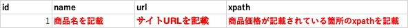

# PriceMonitoring
商品価格を監視し、安ければLINE通知をします。<br><br>[](LICENSE)

## 使い方
1. 価格を監視したい商品情報が掲載されているWebサイトへアクセスします。

2. 商品価格が記載されている箇所のxpath、商品名、サイトURLを確認します。
    - xpath確認方法が不明の方は「xpath 確認方法」などで検索いただければと思います。

3. price_manage.xlsx「対象サイト」シートにidと手順2で確認した情報を記載します。
    - idは1から連番で付与していただければと思います。
    - idは重複しないようお願いします。（重複した場合、正しく動作しません。）

4. excel.pyの変数「FILEPATH」の''内にprice_manage.xlsxのフルパスを記載します。

5. log.pyの変数「handler」の''内にログを出力したいファイルのフルパスを記載します。
    - ファイル種類はtxtでファイル名は任意です。

6. LINE NotifyのサイトでLINE Notify APIを利用するためのアクセストークンを発行・取得します。

7. notice.pyの変数「TOKEN」の''内にアクセストークンを記載します。

8. requirements.txt記載のパッケージをインストールします。 

9. cronなどで、web_scraping.pyの定期実行を設定し完了です。

### 補足：pipを使用したパッケージ一括インストール
```
pip install -r  requirements.txt
```

## 環境
- Python3
- Microsoft Office
- LINE

## 注意事項
- 本リポジトリ内のソースコードの実行前に、対象の商品を掲載しているWebサイトのWebスクレイピングが禁止されていないことを必ず確認下さい。

- price_manage.xlsxは情報が正しく入力されていることを前提としています。<br>※正しく入力されていない場合の処理は実装しておりません。

- 現在はPhase1としてのソースコード公開となります。Phase2としてのソースコード更新・公開は随時行います。
